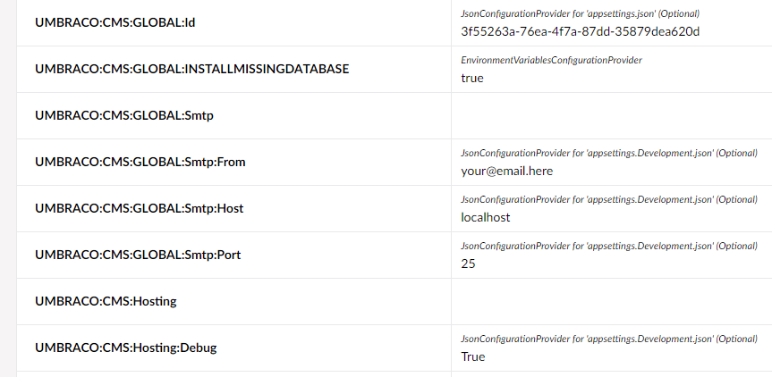

# Cultiv.EnvironmentInspect &middot;   

Cultiv Environment Inspector installs a dashboard in the Settings section of Umbraco, showing you the currently applied environment values and where they are coming from.

For example, we can see some of the values here are coming from `appSetting.json` and `appSetting.Development.json`. 

This makes it easier to learn why some variables you expected to work have not been applied.
